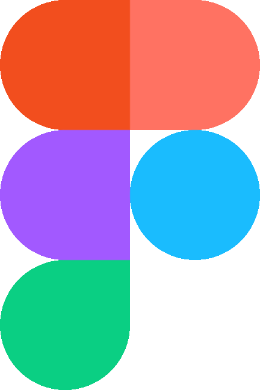
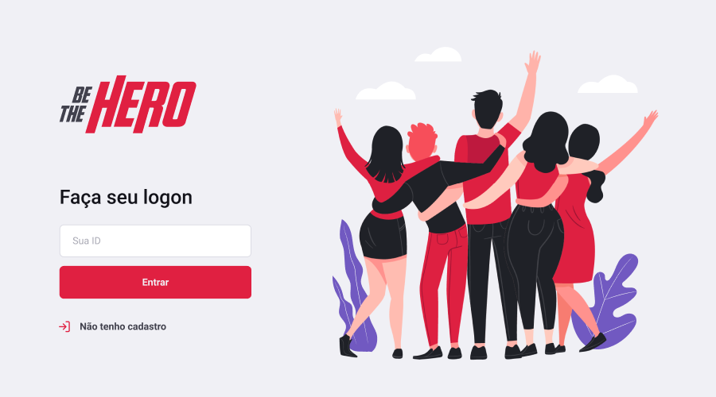
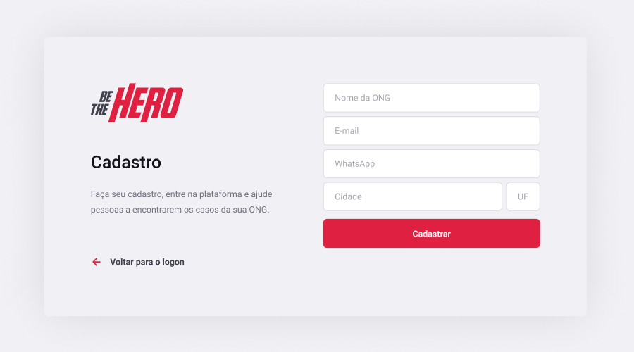
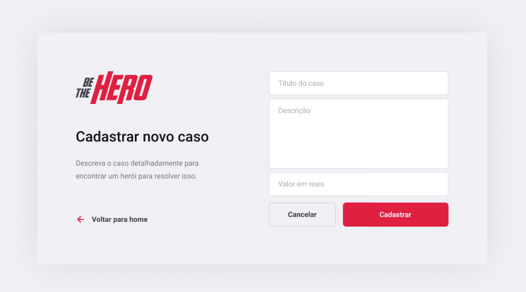
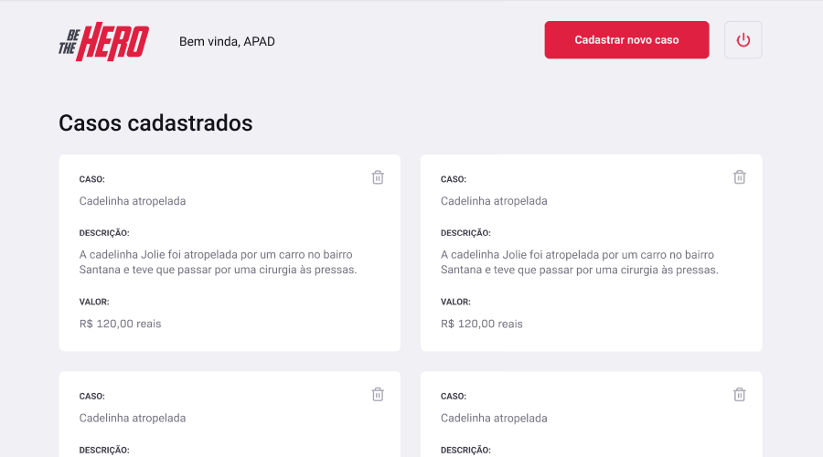
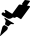

  
  <h1>11ª Semana OmniStack da Rocketseat.</h1>

O projeto *Be The Hero* foi criado durante a **11ª Semana OmniStack** da **Rocketseat** e tem como objetivo conectar pessoas que desejam fazer contribuições monetárias a ONG's que precisam de ajuda.

Instrutor: [Diego Fernandes (CTO Rocketseat)](https://github.com/diego3g)

---

## Tecnologias:

<ul>
  <li>&nbsp; JavaScript</li>
  <li> React</li>
  <li> React Native</li>
  <li>&nbsp; Node.js</li>
  <li>&nbsp; SQLite</li>
    <li>&nbsp; Expo</li>
</ul>

---

## Layout:

 Figma: [Layout da aplicação.](https://www.figma.com/file/2C2yvw7jsCOGmaNUDftX9n/Be-The-Hero---OmniStack-11?node-id=0%3A1)

  
  
  
   
  &nbsp;
  &nbsp;
  

---

## Instruções:

Para instalar as dependências, execute `npm install` nas pastas *backend*, *frontend* e *mobile*.

Para acessar o aplicativo web, execute `npm start` nas pastas *backend*, *frontend* e acesse a página *http://localhost:3000*.

Para acessar o aplicativo mobile, execute `npm start` nas pastas *backend* e *mobile*. Utilize o aplicativo *Expo* instalado em seu celular para ler o QR Code disponível em *http://localhost:19002*. Um emulador Android/iOS também pode ser usado para rodar o aplicativo mobile localmente.

---

 [Rocketseat](https://rocketseat.com.br/) &copy; 2020&nbsp; | 11ª Semana OmniStack
