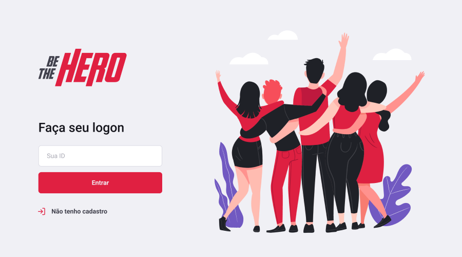
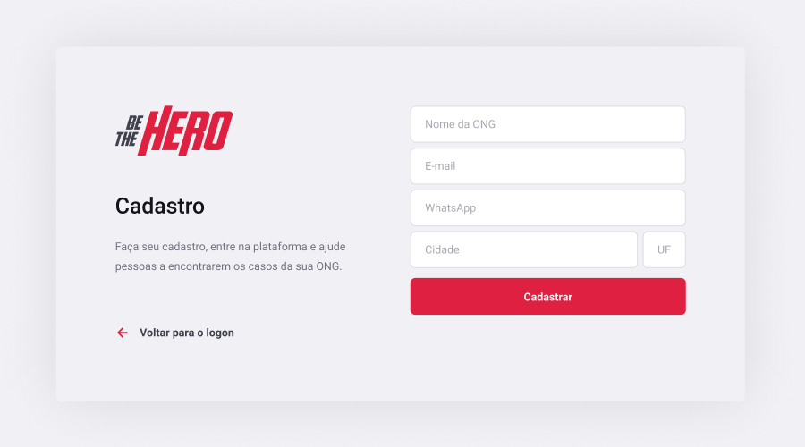
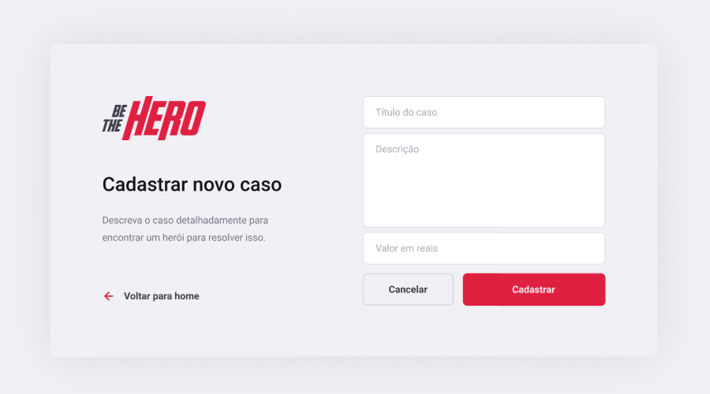
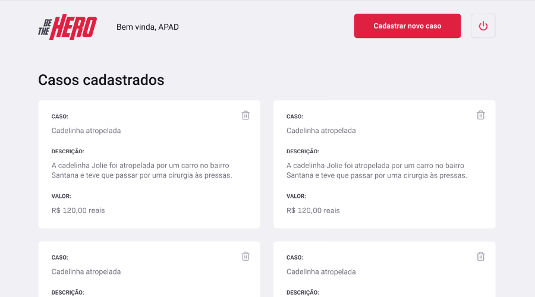

  
  <h1>11ª Semana OmniStack da Rocketseat.</h1>

O projeto *Be The Hero* foi criado durante a **11ª Semana OmniStack** da **Rocketseat** e tem como objetivo conectar pessoas que desejam fazer contribuições monetárias a ONG's que precisam de ajuda.

Instrutor: [Diego Fernandes (CTO Rocketseat)](https://github.com/diego3g)

---

### Tecnologias

Foram utilizados frameworks e libraries da poderosa stack **JavaScript**.

#### Frontend

- [x] React
- [x] Axios (HTTP client)

#### Backend

- [x] Node.js
- [x] Express.js
- [x] Knex (SQL query builder)
- [x] SQLite3

- [x] Celebrate (Validation Library)
- [x] Jest (Testing Framework)

#### Mobile

- [x] Expo
- [x] React
- [x] React Native
- [x] Axios (HTTP client)

---

### Layout

- [x] Figma [Layouts da aplicação.](https://www.figma.com/file/2C2yvw7jsCOGmaNUDftX9n/Be-The-Hero---OmniStack-11?node-id=0%3A1)

  
  
  
   
  &nbsp;
  &nbsp;
  

---

### Instruções

- Para instalar as dependências, execute `npm install` nas pastas *backend*, *frontend* e *mobile*.

- Para acessar o aplicativo web, execute `npm start` nas pastas *backend* e *frontend* e, em seguida, acesse a página *http://localhost:3000*.

- Para acessar o aplicativo mobile, execute `npm start` nas pastas *backend* e *mobile*. Utilize o aplicativo *Expo* instalado em seu celular para ler o QR Code disponível em *http://localhost:19002*. Um emulador Android/iOS também pode ser usado para rodar o aplicativo mobile localmente.

---

 [Rocketseat](https://rocketseat.com.br/) &copy; 2020&nbsp; | 11ª Semana OmniStack
